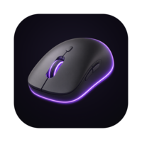
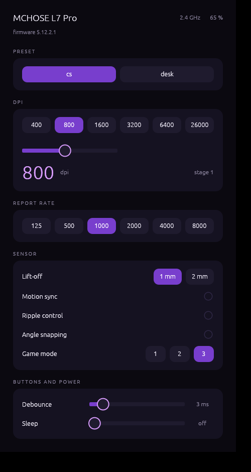
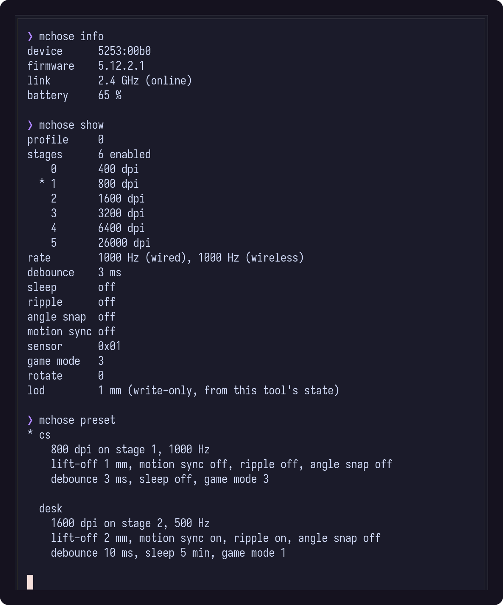

<div align="center">



# mchose-linux

**Configure MCHOSE gaming mice on Linux.** DPI, polling rate, lift-off distance,
debounce and sleep, from a CLI or a small window. No vendor driver, no browser.

*Unofficial. Not made by, affiliated with, or endorsed by MCHOSE. This is an
independent Linux port of settings the vendor only ships for Windows and a web
page.*




</div>

## Why this exists

MCHOSE ships a Windows-only driver and a WebHID page called **M HUB**. There is
no Linux application, and `libratbag` / **Piper** has no device file for these
mice, so on Linux you cannot change the DPI, the polling rate or the lift-off
distance at all. The settings live in the mouse, and the mouse speaks a
protocol nobody had written down.

So it got written down. `PROTOCOL.md` documents the whole thing, recovered from
the M HUB bundle and then verified byte by byte against a real mouse.

## Supported mice

Anything MCHOSE that exposes the vendor HID collection, matched on the vendor ID
plus the collection rather than a hard-coded model list. That covers, at least:

**L7** · **L7 Pro** · **L7 Ultra** · **L7 Pro+** · **L7 Ultra+** ·
**M7** · **M7 Pro** · **M7 Ultra** · **A7** · **A7 Pro** · **A7 Ultra** ·
**A7 V2** · **K7 Ultra** · **AX5** · **A5**

Developed and verified on an **MCHOSE L7 Pro** (`5253:1020`, 8 kHz dongle,
26000 DPI, firmware 5.12.2.1). Other models use the same frame and should work;
if yours does not, open an issue with the output of `mchose devices` and
`mchose log`.

## Install

```sh
git clone https://github.com/alexfrih/mchose-linux.git
cd mchose-linux
./install.sh
```

Builds both binaries, symlinks them into `~/.local/bin`, adds the desktop entry
and installs a udev rule (one `sudo`). The rule is what makes the mouse's hidraw
node readable by your user. Without it nothing works, and the M HUB web page
fails silently too, which is worth knowing on its own.

Rust and `cargo` are the only build requirements. At runtime the CLI depends on
`libc` and nothing else: no `hidapi`, no `libusb`, no daemon, no root.

## Use

```sh
mchose info                    # model, firmware, battery, link
mchose show                    # DPI stages, report rate, debounce, sleep
mchose dpi 1600                # set the active stage
mchose dpi --list 400,800,1600,3200,6400,26000
mchose stage 2                 # switch the active stage
mchose rate 8000               # 125 500 1000 2000 4000 8000
mchose lod 1                   # lift-off distance in mm
mchose motion-sync on
mchose debounce 3
mchose sleep 0                 # 0 disables sleep
mchose backup                  # save the config block
mchose restore <file>
mchose log                     # every frame sent and received
```

Every write is read back and compared, so a command that prints a result changed
the mouse. A command that could not is an error, never a silent no-op. The first
write of any kind saves the mouse's original configuration to
`~/.local/state/mchose/config.original.bin`, once, so there is always a way back.

`mchose-gui`, or **Mouse** in your application launcher, is the same thing in one
window. Everything applies as you touch it and the mouse is read back
afterwards, so what is on screen is what the mouse holds, never what was asked
for.

## Presets

```sh
mchose preset                  # list them, mark the one in effect
mchose preset cs
mchose preset desk
mchose preset save mine        # keep your current settings under a name
```

**`cs`** is what competitive Counter-Strike players run, on the mouse side: 800
DPI, 1000 Hz, and everything that smooths or delays turned off. Motion sync
costs about a millisecond by pinning sensor reads to the polling clock, ripple
control is smoothing, and angle snapping invents straight lines you did not
draw. Lift-off at 1 mm so the crosshair holds still while you re-centre, a 3 ms
debounce, and sleep after five minutes of inactivity. Playing does not count
as inactivity; leaving a mouse on overnight should not keep it awake.

**`desk`** takes the opposite trade: 1600 DPI, 500 Hz, smoothing on, lift-off at
2 mm, a 10 ms debounce so a tired switch never double-fires in a file manager,
and a real sleep timer, because this one runs all day on a battery.

Presets ride your existing DPI ladder rather than rewriting all six stages, so
the button on the mouse keeps working. Saved presets live in
`~/.config/mchose/presets.conf`, plain text, and a name there shadows a built-in.

## How it works

The mouse's third USB interface carries two vendor HID collections, `0xFF01` and
`0xFF0B`. Every setting is a **feature report** on report ID `0x11` (20 bytes) or
`0x12` (64 bytes), with the whole payload inverted `^ 0xFF`, padding included.
There is no checksum. `PROTOCOL.md` has the frame, both command tables, the
config block field by field, and the six things the vendor's own code does not
say and the hardware does.

`protocol/` holds the two scripts that recover it: `fetch.sh` downloads the M HUB
bundle, `extract.sh` deobfuscates it. **MCHOSE's bundle is not redistributed
here** — the scripts fetch it from the vendor at run time. `tools/deobf2.mjs`
resolves obfuscator.io string arrays scope-aware through Babel, evaluating each
array/decoder/rotation group in a VM and rewriting the AST; `webcrack` alone does
not get through this one.

## FAQ

**Does MCHOSE work on Linux?** The mouse works as a mouse out of the box. Its
*settings* do not: there is no vendor Linux app, and libratbag/Piper does not
recognise it. This project is the missing piece.

**Is there an M HUB alternative for Linux?** This is it, for the mice above.
The official M HUB web driver does work in a Chromium browser once the udev rule
here is installed, but it cannot script anything and needs a browser open.

**How do I change MCHOSE DPI on Linux?** `mchose dpi 1600`.

**How do I set the polling rate to 8000 Hz on Linux?** `mchose rate 8000`.

**Does it need root, or a background daemon?** Neither. The udev rule is
installed once; after that everything runs as your user, and nothing stays
resident.

**Will it work with Wayland / KDE / GNOME?** Yes. It talks to the mouse over
hidraw and never touches the display server. The window is
[egui](https://github.com/emilk/egui) and runs on both Wayland and X11.

**Can it brick my mouse?** Nothing here writes firmware. The first write saves
your original configuration and `mchose restore` puts it back.

## Contributing

Adding a model is usually nothing more than confirming it answers. Run
`mchose devices`, then `mchose info` and `mchose show`, and open an issue with
the output plus `mchose log`. If the config block comes back with plausible DPI
stages, it already works.

## Related

- [libratbag](https://github.com/libratbag/libratbag) and
  [Piper](https://github.com/libratbag/piper) — the general Linux gaming-mouse
  stack, which does not cover MCHOSE
- [Solaar](https://github.com/pwr-Solaar/Solaar) — the same idea for Logitech

## Licence

MIT. See `LICENSE`.

MCHOSE, M HUB and the model names are trademarks of their respective owner and
are used here only to say which hardware this software talks to.
